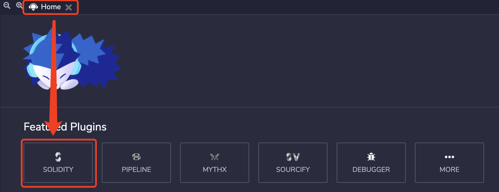
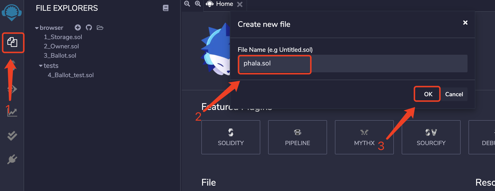
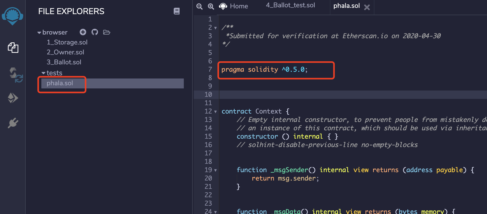
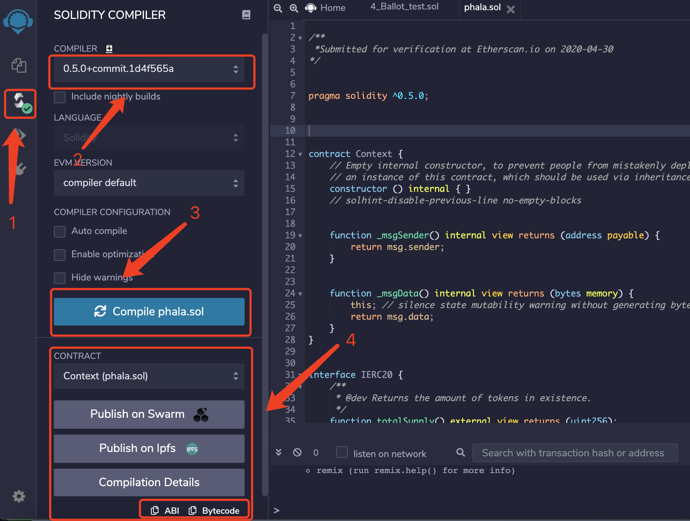

# 编译合约
1. 打开以太坊合约 [Remix在线编译器](https://remix.ethereum.org/) ，并在`home`页面选择`Solidity`

2. 点击左边的 '+' 号新增合约`phala.sol`

3. 将根目录下的 [phala-token.sol](../phala-token.sol) 的内容复制粘贴到Remix的`phala.sol`，使用的solidity版本是v0.5.0

4. 在右侧标签页切换到编译页面；更改`COMPILER`版本为0.5.0；点击`Complie phala.sol`按钮，出现编译后的结果，下方包含ABI接口和bytecode

