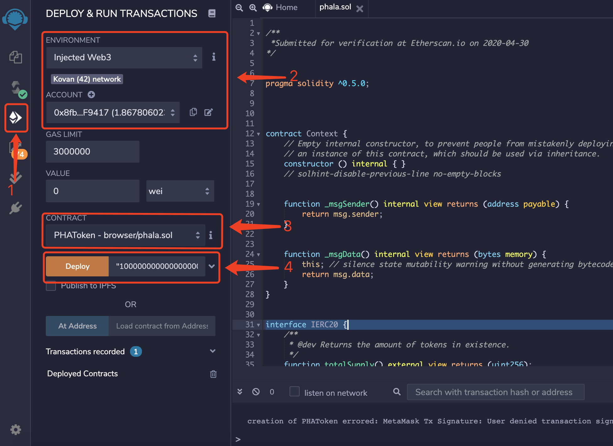
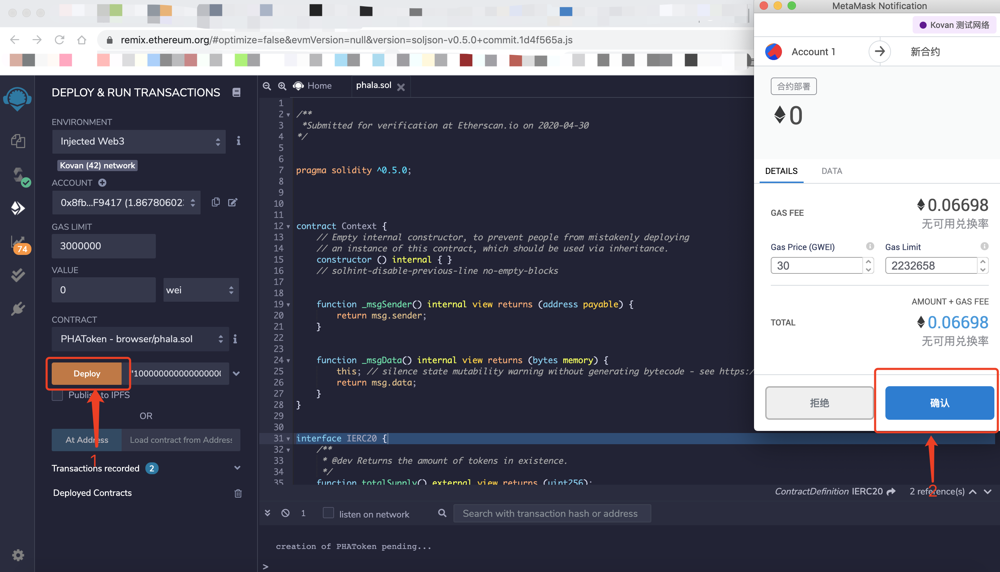
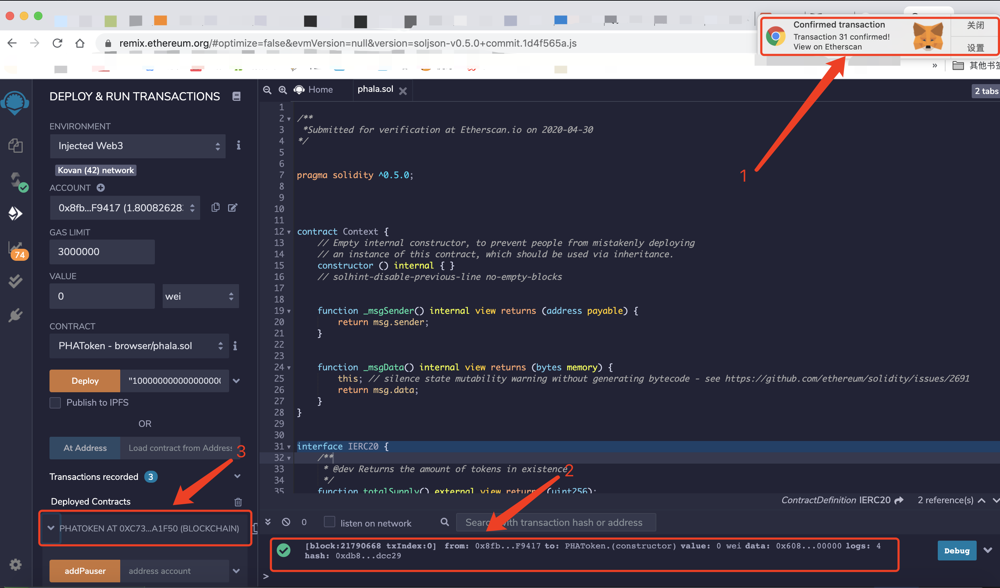

# 部署Phala合约
1. 参考 [Compile.md](./docs/Compile.md) 编译`Phala`合约
2. 在右侧标签页切换到部署页面；更改`ENVIRONMENT`选项为`Injected Web3`，此时默认连接到`MetaMask`钱包，显示`Kovan network`，`ACCOUNT`出现钱包地址；更改`CONTRACT`选项为`PHAToken-brower/phala.sol`，此时下方的`Deploy`按钮旁出现一个文本框，框中需要输入发行总量（发行数量乘以10的18次方得到的整数）  

3. 点击`Deploy`按钮，此时会调用`MetaMask`钱包，弹窗生成一个部署合约交易；点击`确认`按钮，即可部署合约到`Kovan`测试网  

4. 部署成功后，右上角出现`MetaMask`的交易确认提醒；下方调试窗口会出现交易的链上详情（可以点击查看）；左下角`Deployed Contracts`会出现`PHATOKEN AT 0x...`的合约信息，点击后可以看到合约中可调用的方法  

