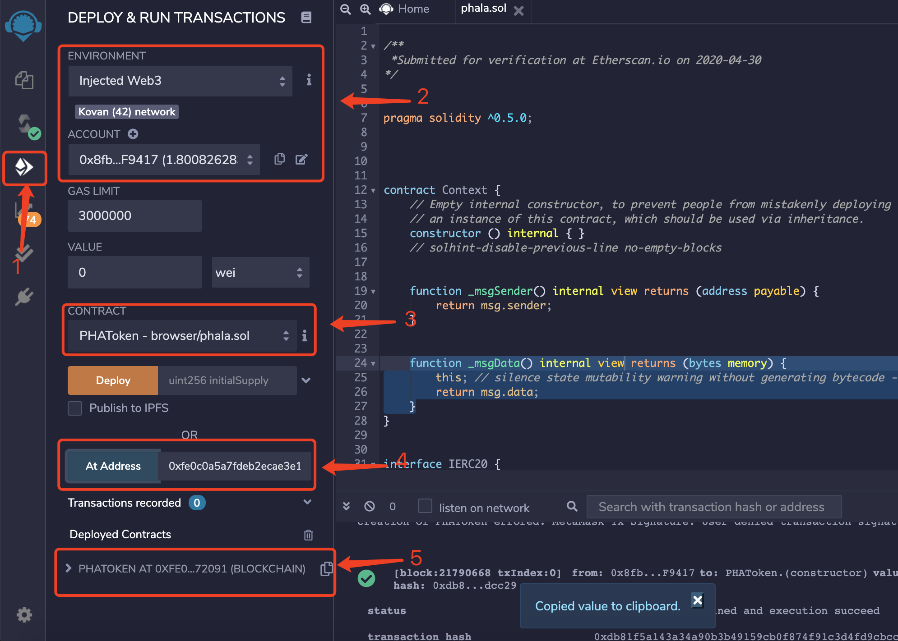
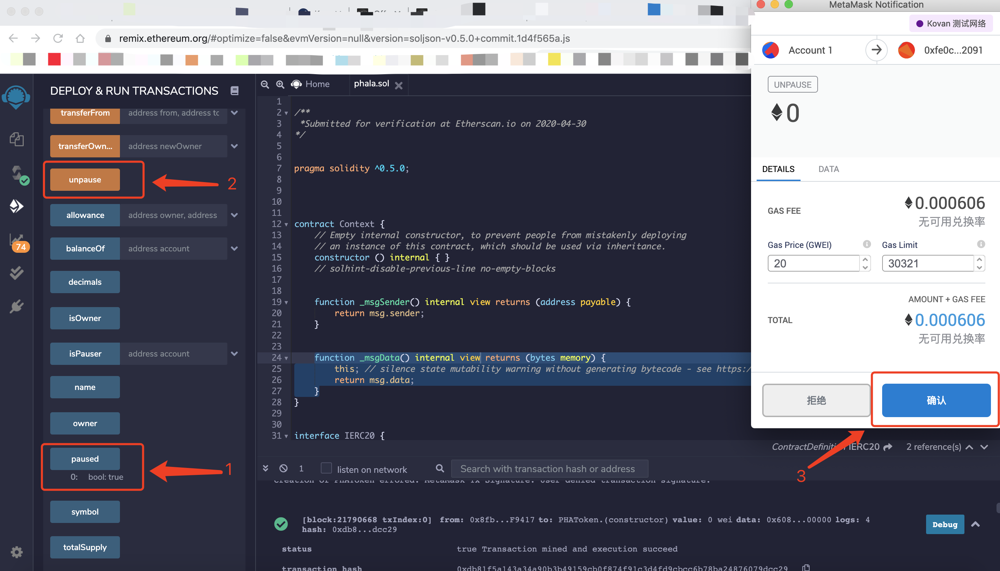
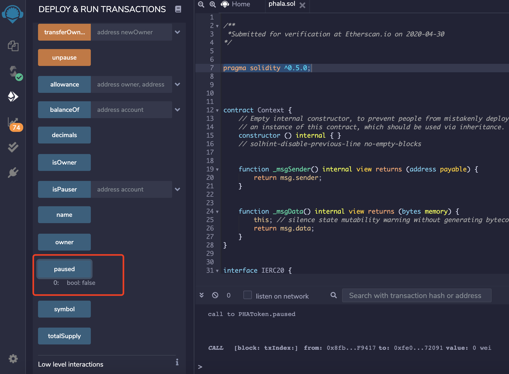
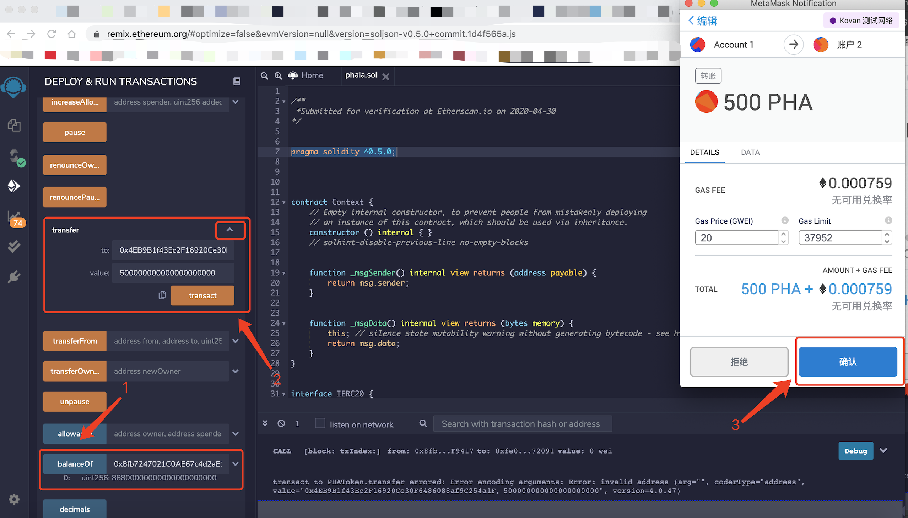
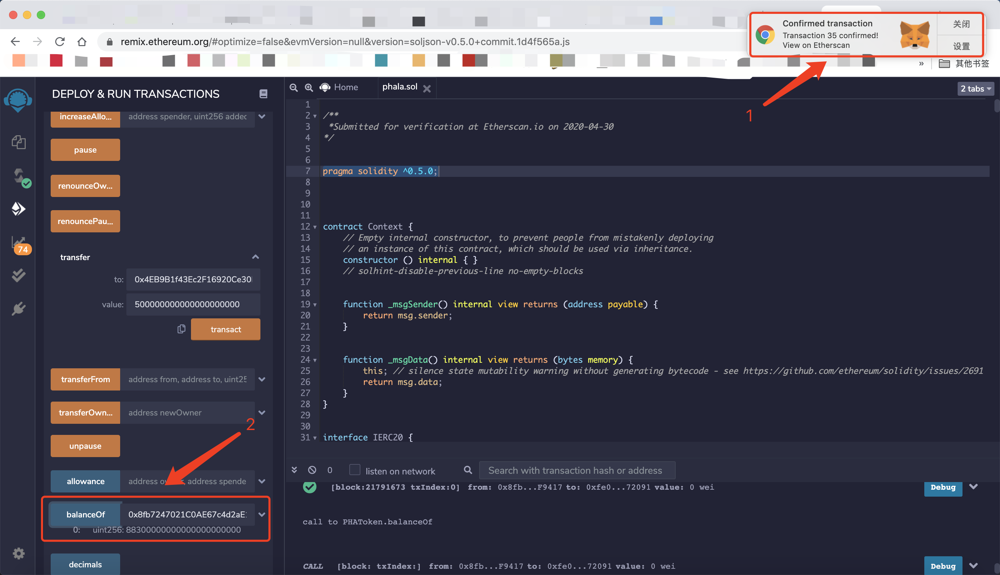

# 调用已部署的Phala合约 
(已部署的合约地址：0xfe0c0a5a7fdeb2ecae3e1567568923e035472091)
1. 参考 [Compile.md](./docs/Compile.md) 编译`Phala`合约
2. 在右侧标签页切换到部署页面；更改`ENVIRONMENT`选项为`Injected Web3`，此时默认连接到`MetaMask`钱包，显示`Kovan network`，`ACCOUNT`出现钱包地址；更改`CONTRACT`选项为`PHAToken-brower/phala.sol`；下方的`At Address`按钮的文本框填入已部署的合约地址`0xfe0c0a5a7fdeb2ecae3e1567568923e035472091`; 点击`At Address`按钮，`Deployed Contracts`会出现`PHATOKEN AT 0x...`的合约信息，点击后可以看到合约中可调用的方法

3. 点击调用`paused`方法，可以获取到合约是否暂停的状态；如果下方出现`bool:true`，表明合约处于暂停状态；需要使用合约的`owner`账号，调用`unpause`方法，解除暂停状态；此时会调用`MetaMask`钱包，弹窗生成一个解除暂停交易，点击`确认`发送交易  

解除暂停交易成功后，再次调用`paused`方法，下方出现`bool:false`，表明合约解除暂停状态；

4. 在`balanceOf`方法后填入自己的钱包地址，点击调用`balanceOf`方法，可以查询当前地址的pha余额；点击`transfer`后的三角箭头，展开参数框，填入转入地址`to`和转账数量`value`（数量乘以10的18次方得到的整数）；点击`transact`按钮，此时会调用`MetaMask`钱包，弹窗生成一个转账交易，点击`确认`发送交易；

转账交易成功后，再次调用`balanceOf`方法，可以查询到最新的当前地址pha余额，显示余额已经减少了刚才转账的数额

